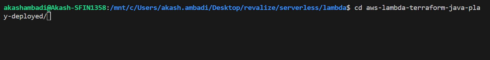
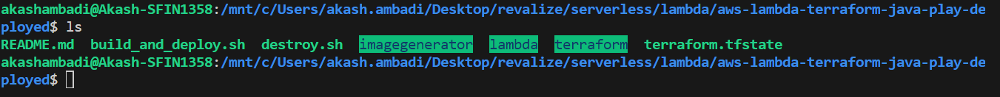
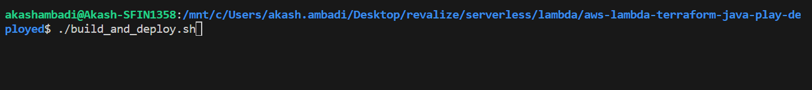
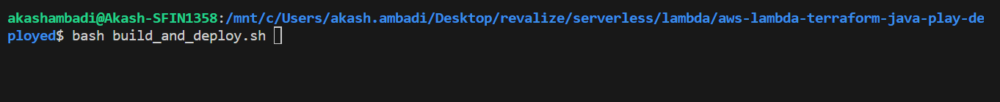
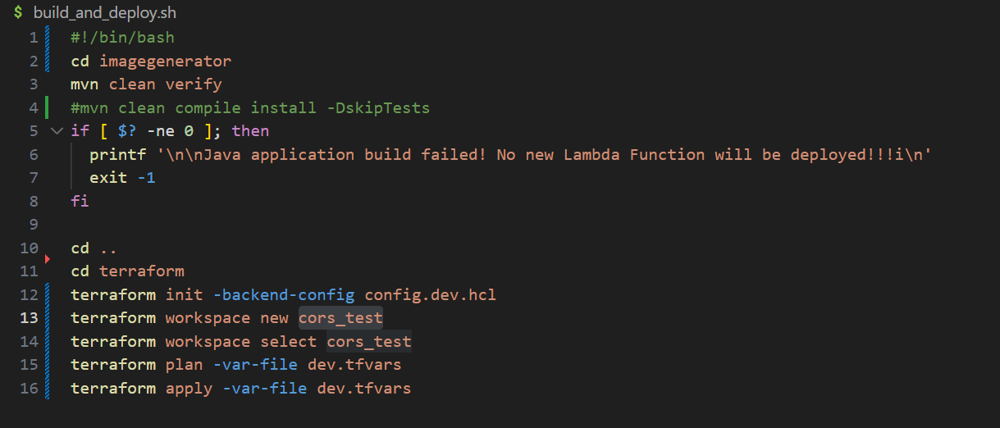

# Omniplanner

*"This application converts input SVG format into the requested PDF, JPG, or PNG formats."*


## Table of Contents
1.[Getting Started Terraform Deployment Steps](#steps-to-deploy-lambda-omni-planner-through-terraform)

2.[Java Maven Steps](#java-maven)

## Steps to deploy lambda omni-planner through Terraform

1.cd into the directly where all the terraform, lambda and image generator codes are present.

Ex. In my case the directory is “aws-lambda-terraform-java-play-deployed/” like shown in below picture



2.When we cd into the directory “aws-lambda-terraform-java-play-deployed/” we can see the files  shown in picture below.




3.Now run the command ./build_and_deploy.sh or bash build_and_deploy.sh as shown in below.



OR



4.Now the above code will run the shell script which will test, build and create the artifact and also create terraform workspace and deploy the artifact to lambda. If you want to run same code in different environment change the .tfvars file and change workspace names in the places shown below
Ex. for me i have created a cors_test workspace and selected workspace before deploying the code.



## Java Maven 
### Steps & Commands: Java and Maven commands (To Run  & Build locally )

**Note :** 

>These steps are optional and can be used to just build, run and test locally, As all these steps are executed automatically when deployed through terraform.

>Make sure you are inside the “terraform/aws-lambda-terraform-java/imagegenerator" directory and import it as a maven project in STS ide or in Intellij Idea you can open the above directory directly.

#### Run the application locally

1. Go to pom.xml and uncomment the below dependency 

```
            <dependency>
                <groupId>org.springframework.cloud</groupId>
                <artifactId>spring-cloud-starter-function-web</artifactId>
            </dependency>
            <dependency>
                <groupId>org.springframework.cloud</groupId>
                <artifactId>spring-cloud-function-compiler</artifactId>
            </dependency>
```
**NOTE :**

>And make sure to comment it when building a jar to deploy at AWS, As above dependency is not required at cloud environment.

2.Set the below properties in  system env

> accessKey=(value you may get it from aws console); accessSecret=(value you may get it from aws console); region=us-east-1 ;topicArn=(value you may get it from aws console)

or if you are using IDE for eg STS or Intellij Idea
right click on ImageGeneratorApplication.java ->> go to modify run configuration ->> inside Environment Variable row mentioned  below properties separated by ";" and apply and run.

> accessKey=(value you may get it from aws console); accessSecret=(value you may get it from aws console); region=us-east-1;topicArn=(value you may get it from aws console)

3.when accessing the spring cloud function locally enclosed the whole request inside 

```
{
  "generatorInput": {
    "paramDictionary": {}
  }
}

```
#### Build the JAR locally

1. mvn clean compile install
2. mvn clean compile install -DskipTests (build skipping the test)

you can run the above command through command prompt(from java maven project directory) or through IDE.

#### Steps to configure SNS at Aws Dashboard

1. login to aws console
2. Search and go to [SNS](https://us-east-1.console.aws.amazon.com/sns/v3/home?region=us-east-1#/topic/arn:aws:sns:us-east-1:750515430717:omniplanner-error-topic) service section -> select **Topics**  from the left panel 
there you will find list of topics name, select **omniplanner-error-topic** -> there 
you will find the details of topic like arn: ,topic owner etc.
3. There will be option to **Create Subscription** **Delete**  **Edit** to manipulate accordingly.

#### Steps to configure CloudWatch Synthetics Canaries at Aws Dashboard

1. login to aws console
2. Search and go to [CloudWatch](https://us-east-1.console.aws.amazon.com/cloudwatch/home?region=us-east-1#synthetics:canary/list) services section -> from left panel select **Application monitoring** -> then select **Synthetics Canaries**
3. There will be option to **Create Canary,** **edit,** **stop** ect.
4. select **omni-planner-canaries** to see details about canary,Also you may select **Action** tab to edit the canary if needed.
5. If you wish to select edit ,there you find multiple options to edit CRON expressions,Edit dummy request,Run continuously ,Environment variables,Data retention,Data Storage,Additional configuration ,Active tracing - optional etc.